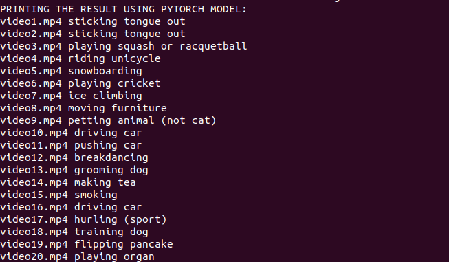
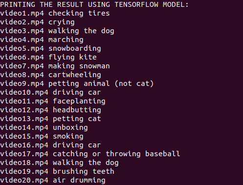

# HumanActivityRecognition

<br>

## Task

This task involves creating a pipeline to test out inference from two different Human Activity recognition models (PyTorch and
TensorFlow) which have been trained on the Kinetics dataset.

## Installation 

### The code has been tested on Ubuntu 18.04 with Python 3.6

1. Install virtualenv

```
sudo apt install -y python3-venv
```

2. Clone the Repo

```
git clone https://github.com/HimanchalChandra/HumanActivityRecognition.git
```

3. Navigate to the sub-folder

```
cd HumanActivityRecognition
```

4. Initialize virtual environment 

```
python3 -m venv my_env
```

5. Activate the virtual environment

```
source my_env/bin/activate
```

6. Upgrade pip 

```
(my_env) pip install --upgrade pip
```

7. Install the dependencies

```
(my_env) pip install -r requirements.txt
```

8. Download the pre-trained models from [here](https://drive.google.com/file/d/1gb2d3WWFtKi87LRZ9udOb17O7-xPVHa_/view?usp=sharing), and extract the zip file in the HumanActivityRecognition folder itself.

9. For Pytorch Model use this script ('pyt' is the command line argument for PyTorch Model):

```
(my_env) python final_pipeline.py --video_root ./videos --model resnext-101-64f-kinetics.pth --type pyt
```

10. For TensorFlow Model use this script ('tf' is the command line argument for TensorFlow Model):

```
(my_env) python final_pipeline.py --video_root ./videos --model i3d-kinetics-400_1 --type tf
```
11. Refer Task_Writeup in this repo for detailed step-by-step procedure.

## Result

1. PyTorch Model:

<br>

<p align="center">
 
</p> 

<br>

3. TensorFlow Model:

<br>

<p align="center">
 
</p> 

<br>

